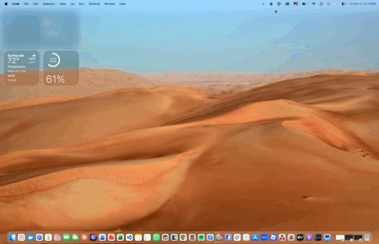

# Desktop Pet

Desktop Pet is a native macOS menu-bar app that turns upcoming Apple Calendar events into friendly, animated reminders. A frog or chick walks across the active display, pauses beside an event bubble, and then leaves without interrupting the current app.

## Demo



[Watch or download the full-quality video](docs/demo/desktop-pet-preview.mov)

The demo uses the built-in **Preview reminder** action. Calendar details in the recording are blurred for privacy.

## Features

- Reads selected calendars through EventKit, including Google calendars already synchronized with Apple Calendar.
- Shows two configurable reminders per event (30 and 10 minutes before by default).
- Rotates between animated frog and chick pets and faces them in their direction of travel.
- Displays the event title, start time, and time remaining in a clickable reminder bubble.
- Opens the event in Calendar when the bubble is clicked.
- Reveals a dismiss button when the reminder is hovered.
- Groups reminders that become due at the same time into one appearance.
- Refreshes after calendar changes and when the Mac wakes.
- Supports pausing reminders and launching automatically at login.
- Keeps calendar access and preferences on the Mac; the app has no accounts, analytics, or network service.

All-day, cancelled, and declined events are ignored. Each reminder appearance is delivered at most once while the app is running.

## Requirements

- macOS 14 or later
- Xcode with the macOS development tools
- Apple Calendar access for live reminders

## Run the app

### Xcode

1. Open `DesktopPet.xcodeproj` in Xcode.
2. Select the `DesktopPet` scheme and the **My Mac** destination.
3. Run the project.
4. Click the paw icon in the menu bar.
5. Choose **Preview reminder** to see a test event without granting Calendar access.

### VS Code or another terminal

Xcode must be installed for its macOS toolchain, but you do not need to open it:

```sh
DEVELOPER_DIR=/Applications/Xcode.app/Contents/Developer \
  xcodebuild -project DesktopPet.xcodeproj -scheme DesktopPet \
  -destination 'platform=macOS' \
  -derivedDataPath /tmp/DesktopPetDerived build

open /tmp/DesktopPetDerived/Build/Products/Debug/DesktopPet.app
```

Click the paw icon in the menu bar and choose **Preview reminder**.

For live reminders, choose **Connect Apple Calendar**, approve read access, and select the calendars to monitor in **Settings…**. Calendars from services such as Google must already be synchronized with Apple Calendar.

## Using Desktop Pet

The menu-bar panel lets you enable or pause reminders, preview the animation, open Settings, launch Calendar, or quit the app. Settings provide:

- first and second reminder intervals;
- monitored calendars;
- launch-at-login behavior; and
- another test-reminder preview action.

When a reminder appears, click its bubble to open Calendar, hover over it to reveal the dismiss button, or let the pet finish its crossing and disappear. Dismissing one appearance does not cancel the other reminder interval.

## Privacy

Desktop Pet requests full EventKit access because macOS requires it to read event details. Event titles, times, calendar selections, and preferences stay local. The app makes no network requests and includes no telemetry, analytics, account system, server, database, sound, or AI features.

## Development

Build and test from the command line with the full Xcode toolchain:

```sh
DEVELOPER_DIR=/Applications/Xcode.app/Contents/Developer \
  xcodebuild -project DesktopPet.xcodeproj -scheme DesktopPet \
  -destination 'platform=macOS' build

DEVELOPER_DIR=/Applications/Xcode.app/Contents/Developer \
  xcodebuild -project DesktopPet.xcodeproj -scheme DesktopPet \
  -destination 'platform=macOS' test
```

The app is organized into a few focused components:

- `CalendarService` reads and filters EventKit events.
- `ReminderScheduler` creates deterministic reminder candidates.
- `AppModel` refreshes calendars, checks due reminders, and persists settings.
- `ReminderPanelController` presents the non-activating overlay and controls its crossing animation.
- SwiftUI views render the menu-bar panel, settings, reminder bubble, and GIF pets.

Scheduler behavior is covered by `DesktopPetTests/ReminderSchedulerTests.swift`.

## Project status

The source implementation is complete for the feature set documented above. This repository is distributed as an Xcode project rather than a signed installer or App Store release. Manual timers, travel-time calculations, meeting-link detection, sound, and exact-start notifications are intentionally outside its scope.
